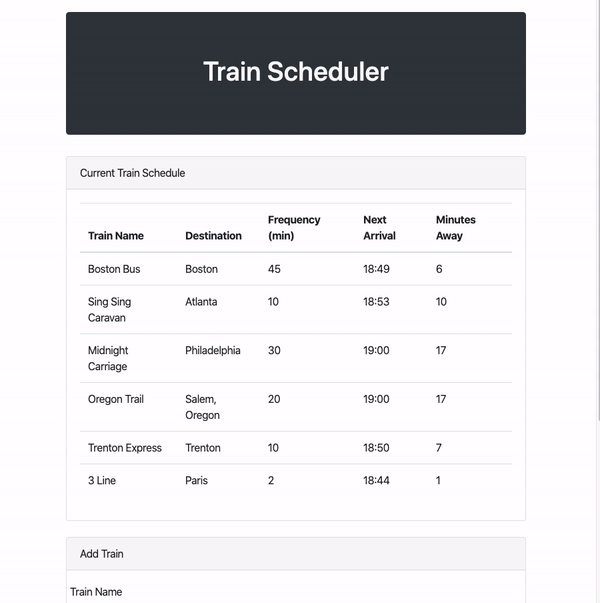

# Firebase Assignment - Train Scheduler

Train Scheduler App.

[Link to page](https://reekamaharaj.github.io/TrainScheduler/)

## Description
Application provides a user with the ability to see a train scheduler. The scheduler updates with the arrival of the next train and how maybe mins away it is. The user can also add new trains.

## How to use
On the top of the page the user can see information on trains. The following information is displayed on the page.

- Train name
- Destination
- Frequency in mins
- Next Arrival time in military time
- How many mins until the train arrives

The user is also able to add trains to the chart with the form on the bottom of the page.

## Tech used
- HTML
- CSS
- Firebase
- Javascript
- Visual Studio
- [Moment](https://www.npmjs.com/package/moment)

## Role in Development
Page layout and functionality

